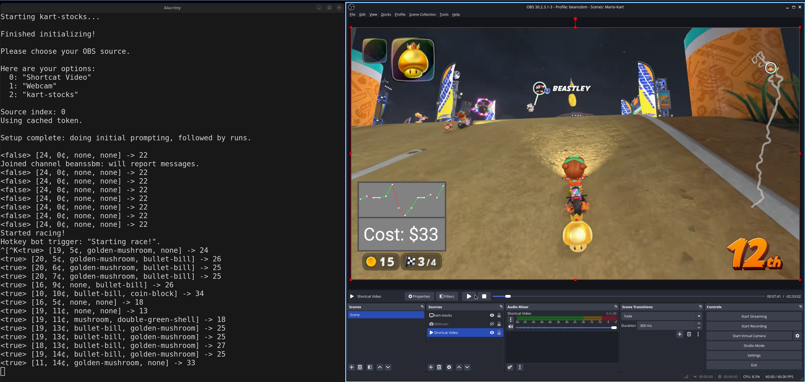

# Kart Stocks
## Copyright 2026 Benjamin Massey

## Overview

An interactive Twitch chat game where viewers can treat a Mario Kart World player's current race as a stock to invest in.

Stock value is determined by an analysis of the current game state: amount of time, which items are held, what place the racer is in, and how many coins the player has.

By buying low and selling high, viewers can increase their fake money pool and claim bragging rights as the greatest Mario Kart day trader to ever do it!

## Tech Stack

The bot chats with Twitch chat via IRC: [twitch-irc](https://crates.io/crates/twitch-irc).

Game screenshots for analysis are gathered via OBS WebSocket server: [obws](https://crates.io/crates/obws).

Coin count is gathered from OCR image-to-text: [ocrs](https://crates.io/crates/ocrs) / [rten](https://crates.io/crates/rten).

Items and placement are determined by a vision-enabled locally-run LLM: [llamacpp_embed](https://github.com/BenjaminMassey/llamacpp_embed).

Window is generated in a game engine: [macroquad](https://crates.io/crates/macroquad).

User data is output to and read from a local SQLITE file: [rusqlite](https://crates.io/crates/rusqlite).

## OBS Setup

Need to go into OBS, click "Tools" on the top taskbar, click "WebSocket Server Settings", check to enable, then grab the listed password, and place it in `./obws_password.txt`.

You will also add the "Kart Stocks" (default name) window. If OBS gets its window decorator, then add a filter of "Crop/Mask" to remove that (increase "Top" value).

## Local LLM

Please note that the llama.cpp server will, by default, try to load the model into VRAM. If you either do not have a dedicated graphics card, or have one under 8GB, then consider using the `llm.disable_gpu` setting in your `settings.toml`.

The model that I have personally used is Qwen3-VL-8B-Instruct with Q4_K_M (plus f16 mmproj) from here: https://huggingface.co/Qwen/Qwen3-VL-8B-Instruct-GGUF

## Hotkey

Currently, the start and end of a race is determined by usage of the hotkey `CTRL` + `ALT` + `K` (for [K]art!).

In order for this to be picked up on Linux under Wayland, I had to make sure I was in the "input" group, by running `sudo usermod -aG input $USER` and restarting.

## Twitch

You will need to create an account for your kart_stocks bot on Twitch, if you haven't already, after which you will need to "Register Your Application" at [the Twitch developer console](https://dev.twitch.tv/console), such that you end up with a client id and secret. You will also need to set a "Redirect URI", of which the default settings of this application is pointing to "http://localhost:3000".

## Settings

You will need settings specific to your own account and setup, so copy `settings.toml.example` in the repo as simply `settings.toml` and edit it such that any empty values are given the appropriate fields.

## Testing

The current test goes through manually labelled screenshots and displays what the bot analyzer is thinking they display.

In order to see the `println!(..)` statements, use the `--nocapture` flag, like: `cargo test --release -- --nocapture`.

## Usage

With OBS running (and WebSocket enabled), a simple `cargo run --release` should do the trick.

# License

This project is licensed under the [GNU General Public License (GPLv3)](https://www.gnu.org/licenses/gpl-3.0.en.html).

A copy of said license can be found in `LICENSE.md`.
